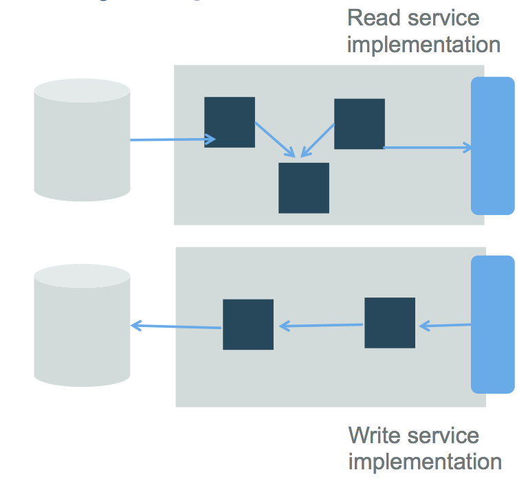

# Command Query Responsibility Separation

You are building an application that is following a Microservices architecture.  The team is not operating in a complete greenfield - there are existing sources of functionality or data that must be reused in order to complete the application on time and within budget.  In particular, you cannot transition all at once to a Scaleable Store because critical data is stored in a large, monolithic database.

**How do you deal with the fact that you can't usually transition all at once between existing monolithic data stores and the database-per-microservice approach?**

The problem is that reading from data is different than writing data.  A service implementation usually has a specific "projection" of a set of relational data that represents a specific view of the data. That view can be usually cached using any of the data caching patterns described in this pattern language. The issue is that writing to the database often involves writing to multiple tables with complex business rules dictating how the information being written needs to be validated and updated. It's that latter code, often encoded in legacy applications, that is difficult to change.

Therefore,

**Use Command Query Responsibility Separation (CQRS) to provide different read models and write models to the same data allowing two different routes to allow you to write microservices as adapters to existing data while allowing you to change the responsiblity of data management over time.**

CQRS separates the "command" operations, used to update application state (also named the 'write model'), from the "query/read" operations (the 'read model'). Updates are done as state notification events (change of state), and are persisted in the event log/store. On the "read model" side, you have the option of persisting the state in different stores optimized for how other applications may query/read the data.

In a very broad sense, this is an application of the [Bounded Context](Context.md) pattern.

CQRS was introduced to most people in [this paper](https://martinfowler.com/bliki/CQRS.html)
