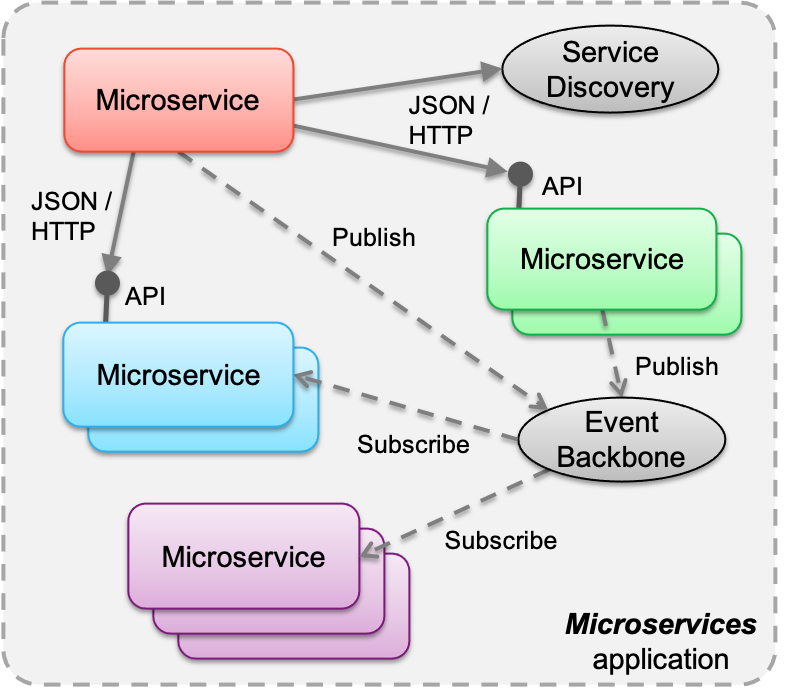

# Event Consumer

You are building a [Microservices Architecture](../Microservices/Microservices-Architecture.md) and you need to decouple one microservice from another

**How do you allow a microservice to find out when data belonging to another microservice changes?**

One of the strengths of the Microservices Architecture can at first appear to be its greatest weakness.  A key tenet of Microservices is that they are decoupled from each other and do not share data through a shared database.  However, there are many cases in microservices development when a microservice will need to know if the state of another microservice has changed in some specific way. 

For instance, if you are building an Airline system, the reservation microservice represents the combination of the fact that a person (a passenger) has booked a specific seat on a specific flight.  However, if that flight is cancelled, how does the reservation microservice discover that fact?  It could constantly query the flight microservice for its current status, but that would be both inefficient and potentially error-prone if the request is made over HTTP, which is notoriously unreliable.

Therefore,

**Declare your microservice as an Event Consumer that can listen in on a channel or topic that indicates that an event has occurred that it is interested in.  When the event occurs, the Event consumer will receive a notification of that event.**

Event consumers are the recipients of the diverse events they may have indicated a preference for. A sophisticated event driven architecture will cater to the existence of diverse types of consumer that are capable of receiving events of varying degrees of complexity, throughputs, technologies and technical  maturity.  Events that an EventConsumer listens to must travel over an [Event Backbone](Event-Backbone.md)

You can see how a Microservice can act as an EventConsumer in the diagram below:

