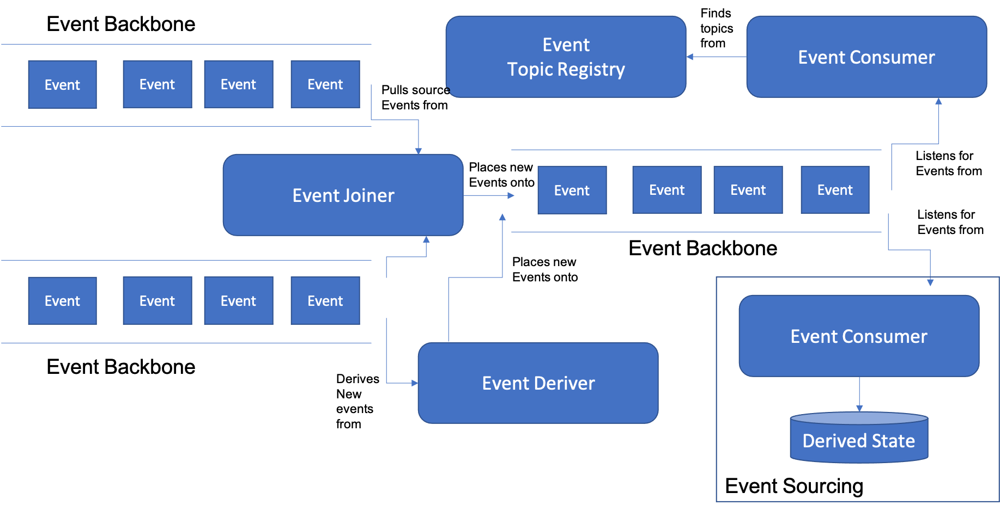

# Event Based Architecture Introduction

In this section we present a small set of linked patterns that represent the fundamental building blocks of an event driven architecture.  This set of tightly related patterns describes the basic issues of why anyone would need an Event Driven Architecture, and how to construct an Event Driven Architecture from component parts.  The patterns discussed are:

+ [Event Based Architecture](Event-Driven-Architecture.md) extends the services concepts of components and loose coupling with a new concept of event coupling  to  further enable evolution of families of applications, in which new  components can be added to the family, enriching the services  provided and the contexts triggering use of those services, without altering interactions between preexisting components and applications in the family. 
+	[Event Backbone](Event-Backbone.md) provides the shared medium allowing multiple Event receivers to obtain events from multiple Event providers without having to know the identity or physical location of their event coupled partners; the Event Backbone also insulates Event receivers and producers from awareness of the network topology and message transport protocols used to receive, move and deliver events.   
+ [Event Sourcing](Event-Sourcing.md) allows you to represent complex application state by scanning over an event stream.
+ [Event Joiner](Event-Joiner.md) helps you tie together related events that form a logical stream of events in order to process the elements in the stream as a group or to deliver them individually to an appropriate processing context where they can be handled. 
+	[Event Deriver](Event-Deriver.md) can build new events from current and old events based on comparisons to previous event data, including temporal information.
+	[Event Aggregator](Event-Aggregator.md) helps you to avoid flooding your Event Backbone with low-level events while allowing other applications dependent upon the results of those events to function.
+	[Event Topic Registry](Event-Topic-Registry.md) provides a way for decoupled event producers and consumers to share essential metadata about events.  If metadata sharing was not possible, event producers would not be able to make event consumers aware of events and event messages, and event consumers would have no way to discover and subscribe to pertinent events. 
+	[Event Consumer](Event-Consumer.md) decouples components by allowing different components (microservices) to only register for and receive those specific events they are interested in.

The relationships between most of the patterns in this section are shown in the diagram below:

